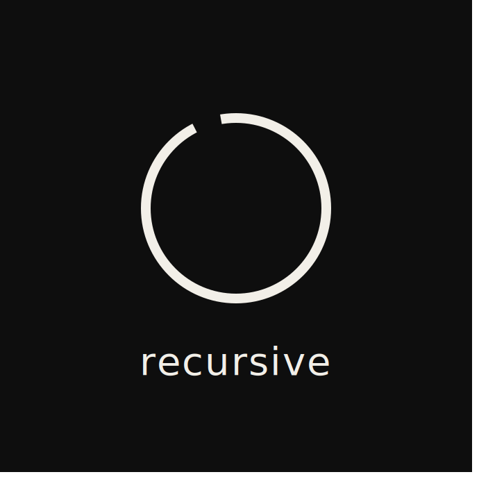
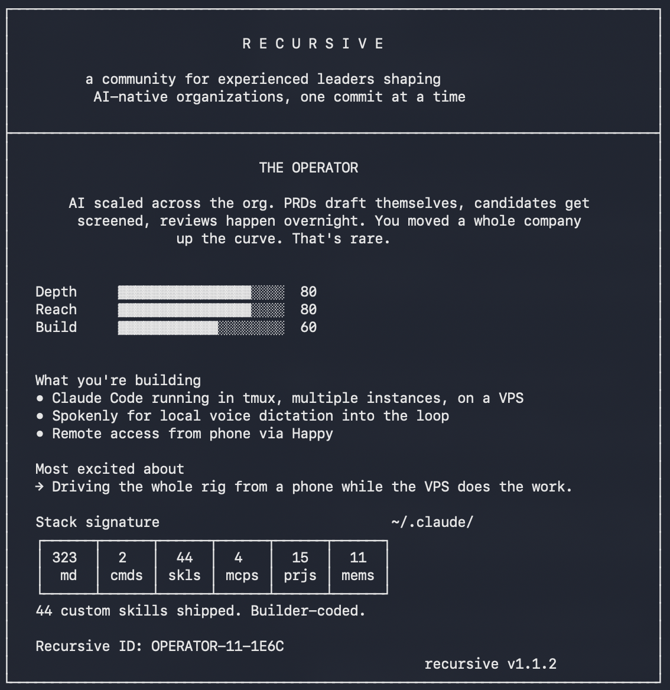

<p align="center">
  
</p>

# /recursive README

> A community for experienced leaders shaping AI-native organizations one commit at a time.

A Claude Code skill that scans your `~/.claude/` setup, asks four questions, and gives you a personalized card.

6 archetypes. 4 dimensions. Your card is your ticket.

By Paul Schraven · [LinkedIn](https://linkedin.com/in/paulschraven) · built to meet other people who point AI at their own workflow.

<p align="center">
  
</p>

## Install

```bash
curl -L -o ~/.claude/commands/recursive.md https://github.com/paulschraven/recursive/releases/latest/download/recursive.md
```

This pulls the latest tagged release (not `main`), so your card is never rendered from a mid-refactor commit. `-L` follows GitHub's redirect from the `/latest/` alias to the current release asset.

**Verify:** open Claude Code and run `/recursive`. You should see the `R E C U R S I V E` banner. Current version is shown in the card footer after you complete the flow.

Or: download `recursive.md` from the [latest release](https://github.com/paulschraven/recursive/releases/latest) and drop it in `~/.claude/commands/`.

## Run

```
/recursive
```

That's it. Two minutes. You get a card.

## How it works

1. **Quick local scan** — reads file counts in `~/.claude/` (CLAUDE.md, custom commands, custom skills, MCP servers, projects, memory files). Counts only, no contents.
2. **Four questions** — automation depth, org-wide contribution, build posture, and one open-ended (voice-friendly) describe-your-setup question.
3. **A draft card** — you review and redact anything you don't want to share.
4. **The final card** — branded, screenshottable, with your Recursive ID baked in.

## Archetypes

| Archetype | Vibe |
|-----------|------|
| **The Conductor** | Firing on every cylinder. We're impressed and slightly suspicious. |
| **The Architect** | Tools as raw material. The cockpit is gorgeous. |
| **The Operator** | AI scaled across the org. You moved a whole company up the curve. |
| **The Tinkerer** | Deep personal stack, narrow blast radius. Next move is obvious. |
| **The Pragmatist** | Solid across the board. Honestly underrated. |
| **The Apprentice** | Early. Hungry. The instinct is there. |

## What it scans

- `~/.claude/CLAUDE.md` (line count)
- `~/.claude/commands/` (count of `.md` files)
- `~/.claude/skills/` (count of subdirectories)
- MCP servers (via `claude mcp list` or fallback grep across config files)
- `~/.claude/projects/` (count of subdirectories)
- `~/.claude/projects/*/memory/` (count of `.md` files)

## What it does NOT do

- No data leaves your machine
- No API calls beyond the model you're already talking to
- No file contents shared anywhere — only counts
- No PII in the output
- You always review the card before anything is shareable

## Community

Your card includes a Recursive ID and a QR code to apply. **Recursive** is a small, curated WhatsApp group for experienced leaders shaping AI-native organizations one commit at a time: hands-on technical, product, and AI leads. Curated. No lurkers. Every member ships.

To apply: screenshot the card, click the `Apply:` link (or scan the QR from another device), submit your screenshot + LinkedIn + WhatsApp number. We review every applicant.

## FAQ

- **Card feels wrong?** Re-run `/recursive`, or [DM me on LinkedIn](https://linkedin.com/in/paulschraven).
- **Didn't hear back?** Applications are reviewed in weekly batches. If it's been >2 weeks, ping me.
- **Found a bug?** [Open an issue](https://github.com/paulschraven/recursive/issues) or ping on LinkedIn.
